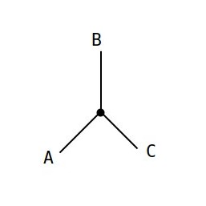

# Tricon_Sort

"" <i> only comparisons allow sorting , 
            no comparisions , no sorting </i>""

1) Basic Sorting Algorithm . 

2) Uses Three point , Comparisons

3) Number of Array Elements = Multiple of Three

4) Able to Place Two Big elements on there positions , after each iteration

## Concept

1] pull
2push
3compare

## How does it Compare

1] truth table
2]unique value creation

## How are the elements Pushed

1] ations based on the unique value created

## Early Exit Feature

## Some thoughts

1] possibility not speed
2] existence of diff ways
